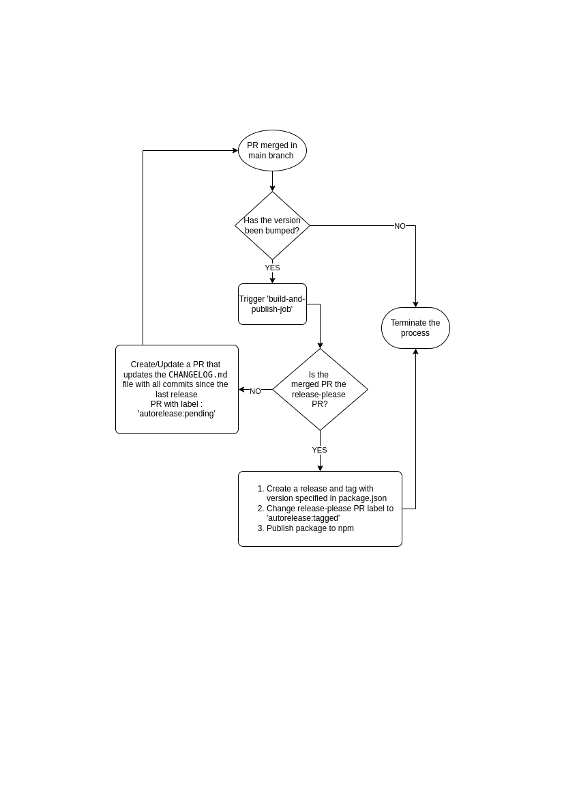

# Release Process

## Overview of Release Process

The release process is divided into several steps, which ensure that the versioning, changelog updates, and publishing are done systematically.

## Release Process Steps

- [Version Check in Pull Requests](#version-check-in-pull-requests)
- [Version Check Upon PR Merge](#version-check-upon-pr-merge)
- [Trigger Build and Publish Job](#trigger-build-and-publish-job)
- [Automatic Changelog Update](#automatic-changelog-update)
- [Release Creation and Publishing](#release-creation-and-publishing)

## Additional Content

- [Manual Workflow Execution](#manual-workflow-execution)
- [Release Process Flow Diagram](#release-process-flow-diagram)

This process is designed to minimize errors and automate as much of the release process as possible.

## Version Check in Pull Requests

Every time a pull request (PR) is created or updated, the version in the PR is compared against the currently published version:

1. **Is the new version the same as the published version?**

   - If **YES**, proceed to merge the PR into the main branch.
   - If **NO**, continue to the next check.

2. **Is the new version lower than the published version?**
   - If **YES**, the PR author is prompted with an error message:  
     `Please update the package version.`
   - If **NO**, the PR author is prompted with an error message to run a specific git command:  
     `Please run the following command and update the PR: git commit --allow-empty -m "chore: release 0.0.19" -m "Release-As: 0.0.19"`

## Version Check Upon PR Merge

Once the PR is approved and merged into the main branch, a check is performed to see if the version has been bumped:

- **Has the version been bumped?**
  - If **NO**, the process terminates.
  - If **YES**, the `build-and-publish-job` is triggered.

## Trigger Build and Publish Job

When the `build-and-publish-job` is triggered, a PR is created or updated to include all commits since the last release, updating the `CHANGELOG.md` file. This PR is labeled with `autorelease:pending`.

- **Is the merged PR the release-please PR?**
  - If **NO**, the process ends after the PR is created or updated.
  - If **YES**, the process continues to release creation.

## Automatic Changelog Update

When preparing for a new version release, the changelog can be updated automatically based on commit messages and PR titles through a pull request. This process simplifies the maintenance of an accurate and up-to-date changelog.

## Release Creation and Publishing

After the `release-please` PR is merged:

1. A release and tag are created with the version specified in `package.json`.
2. The `release-please` PR label is changed to `autorelease:tagged`.
3. The package is published to npm.

This structured process ensures consistency in versioning and changelog updates, while also automating the release and publishing steps to reduce manual intervention.

## Manual Workflow Execution

If the workflow is executed manually and there is no release commit but the package version has been updated:

1. **Release-please** will automatically bump the version according to its default approach, based on the commit history and changes detected. [Learn more about release-please](https://github.com/googleapis/release-please?tab=readme-ov-file#release-please).

2. This ensures that even without a release commit, the versioning remains consistent and follows semantic versioning principles.

## Release Process Flow Diagram

## Reference Documents

For more detailed information about how release-please works and how to configure it, refer to the following resources:

- [How release-please works?](https://github.com/googleapis/release-please?tab=readme-ov-file#how-should-i-write-my-commits)
- [How do I change the release version number?](https://github.com/googleapis/release-please?tab=readme-ov-file#how-do-i-change-the-version-number)

## NOTICE

This work is licensed under the [Apache-2.0](https://www.apache.org/licenses/LICENSE-2.0).

- SPDX-License-Identifier: Apache-2.0
- SPDX-FileCopyrightText: 2024 Contributors
- Source URL: https://github.com/eclipse-tractusx/portal-shared-components
